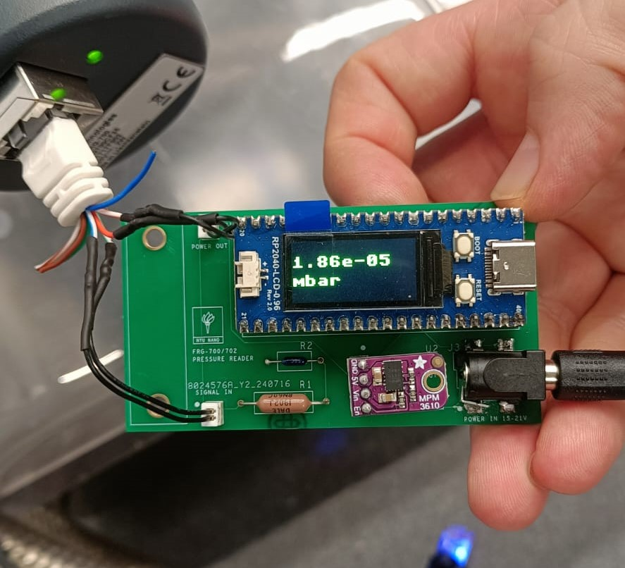
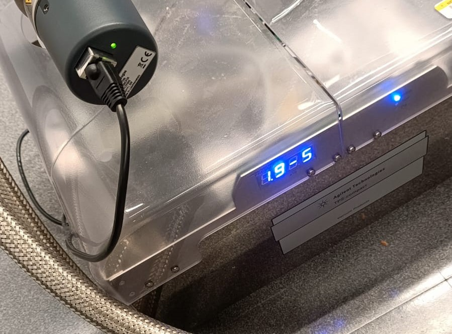

### Pressure-Readout-Board-for-Agilent-FRG-700-702-using-Pico-Board

This repository contains the design and implementation of a Pressure Readout Board specifically for Agilent FRG-700/702 sensors. The board is designed to be mounted directly onto the pressure sensor and features an LED display that shows the pressure along with the unit. Additionally, it includes a custom-designed GUI application for viewing and analyzing data when connected to a computer via USB.

  

### Key Features

- **LED Display**: The board includes an LED display to show real-time pressure readings directly on the sensor.
	

	  
	   
	

- **USB Connectivity**: Connect the board to a computer via USB to access the data through a custom-designed GUI.
- **GUI Application**:
    - **Real-Time Data Viewing**: Continuously plot pressure values at regular intervals for live monitoring.
    - **Data Export**: Export recorded pressure data to an Excel file for further analysis.
    - **Multi-Sensor Support**: View and manage data from multiple pressure sensors simultaneously.
    - **Graphical Representation**: Visualize the data in graph format, allowing for easy comparison and analysis.
    - **Unit Conversion**: Change the pressure reading unit between mbar, torr, and pascal.
- **Data Logging**: Record data at regular intervals for comprehensive logging and analysis.

  

